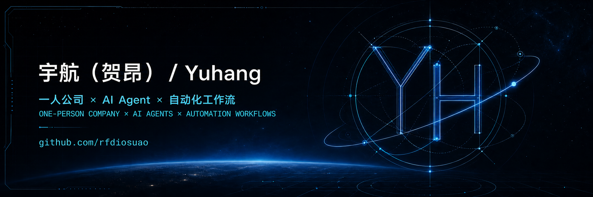

  

<h2 align="center">你好，我是宇航 👋</h2>

  独立开发者 · AI Agent Builder · One-Person Company

  
  
  

我专注于把复杂、重复的业务流程做成可以运行、复用和持续迭代的 Agent 工具。比起只让 AI 回答问题，我更关心它能否真正连接设备、软件和团队工作流，稳定完成现实任务。

## ⚙️ Stack

- **AI / Agents：** LLM Agent、Agent Skill、OpenClaw、多 Agent 协作
- **Automation：** 工作流自动化、客服自动化、飞书集成、REST API
- **Mobile：** Android、Accessibility Service、设备远程控制
- **Creation：** AI 视频、Prompt Engineering、AIGC 内容工作流

## 🚀 Current Focus

- OpenFang 中文本地化与开源 Agent OS
- 可复用的 OpenClaw / Codex Agent Skills
- Android 设备控制与真实业务自动化
- 证据驱动的技术债审计、修复与交付

## 📌 Featured Projects

| 项目 | 解决的问题 | 技术 / 形态 |
| --- | --- | --- |
| [**openfang-cn**](https://github.com/rfdiosuao/openfang-cn) | 面向中文用户的 OpenFang Agent OS 本地化版本 | Rust · Agent OS · i18n |
| [**AgentSkill**](https://github.com/rfdiosuao/AgentSkill) | 把解决过的问题沉淀成可安装、可验证的 Agent Skill | OpenClaw · Codex · Workflow |
| [**Hermes-Agent-phone**](https://github.com/rfdiosuao/Hermes-Agent-phone) | 通过 HTTP API 让 Agent 操作 Android 设备 | Kotlin · Android · REST API |
| [**pdd-cs-gateway**](https://github.com/rfdiosuao/pdd-cs-gateway) | 拼多多客服消息、AI 回复与飞书通知网关 | Python · FastAPI · Feishu |
| [**enterprise-debt-remediation-skill**](https://github.com/rfdiosuao/enterprise-debt-remediation-skill) | 用证据驱动的方法审计并修复企业项目技术债 | Codex · Claude Code · Governance |
| [**Yuhang-ManJu**](https://github.com/rfdiosuao/Yuhang-ManJu) | AI 视频提示词、镜头语言与分镜创作工作流 | Agent Skill · AI Video · Prompt |

## 🐍 Contribution Graph

<picture>
  <source media="(prefers-color-scheme: dark)" srcset="https://raw.githubusercontent.com/rfdiosuao/rfdiosuao/output/github-contribution-grid-snake-dark.svg" />
  <source media="(prefers-color-scheme: light)" srcset="https://raw.githubusercontent.com/rfdiosuao/rfdiosuao/output/github-contribution-grid-snake.svg" />
  
</picture>

## 🤝 Collaboration

如果你正在做 AI Agent、移动自动化或业务工作流，欢迎通过对应仓库的 Issue 发起讨论。安全问题请优先阅读项目中的 `SECURITY.md`，不要在公开 Issue 中提交密钥或真实业务凭证。

Build useful agents. Document the path. Share reusable systems.

